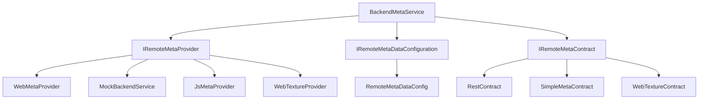

# UniGame Meta Service

Comprehensive contract-based backend transport system for Unity, supporting REST API, JavaScript Bridge, Mock providers, and Web Texture loading with flexible provider architecture.

- [UniGame Meta Service](#unigame-meta-service)
  - [Overview](#overview)
  - [Installation](#installation)
    - [Dependencies](#dependencies)
  - [Core Architecture](#core-architecture)
    - [System Components](#system-components)
    - [Data Flow](#data-flow)
  - [Quick Start](#quick-start)
    - [Basic Setup](#basic-setup)
    - [Configuration](#configuration)
  - [Backend Meta Service](#backend-meta-service)
    - [Service Interface](#service-interface)
    - [Provider Management](#provider-management)
    - [Contract Execution](#contract-execution)
  - [Contract System](#contract-system)
    - [Base Contracts](#base-contracts)
      - [IRemoteMetaContract](#iremotemetacontract)
      - [RemoteMetaContract\<TInput, TOutput\>](#remotemetacontracttinput-toutput)
    - [Contract Types](#contract-types)
      - [Simple Contracts](#simple-contracts)
      - [Web Request Contracts](#web-request-contracts)
    - [Creating Custom Contracts](#creating-custom-contracts)
  - [Providers](#providers)
    - [Web Provider (REST API)](#web-provider-rest-api)
      - [Configuration](#configuration-1)
      - [Settings](#settings)
      - [Usage](#usage)
    - [Mock Provider](#mock-provider)
      - [Configuration](#configuration-2)
      - [Usage](#usage-1)
    - [JavaScript Bridge Provider](#javascript-bridge-provider)
      - [Configuration](#configuration-3)
      - [JavaScript Bridge Setup](#javascript-bridge-setup)
      - [Unity Usage](#unity-usage)
    - [Web Texture Provider](#web-texture-provider)
      - [Configuration](#configuration-4)
      - [Usage](#usage-2)
  - [API Contract Generation](#api-contract-generation)
    - [Swagger/OpenAPI Support](#swaggeropenapi-support)
      - [Generator Settings](#generator-settings)
    - [Code Generation](#code-generation)
      - [Menu Access](#menu-access)
      - [Programmatic Generation](#programmatic-generation)
    - [Configuration Options](#configuration-options)
      - [Response Data Containers](#response-data-containers)
  - [Advanced Features](#advanced-features)
    - [Dynamic URL Parameters](#dynamic-url-parameters)
    - [Response Data Containers](#response-data-containers-1)
    - [Error Handling](#error-handling)
      - [Contract-Level Error Types](#contract-level-error-types)
      - [Global Error Handling](#global-error-handling)
    - [Streaming Assets Integration](#streaming-assets-integration)
  - [Examples](#examples)
    - [Basic Contract Usage](#basic-contract-usage)
    - [Advanced Web Provider](#advanced-web-provider)
    - [Mock Testing](#mock-testing)
  - [Best Practices](#best-practices)
  - [Troubleshooting](#troubleshooting)
    - [Common Issues](#common-issues)
      - ["MetaService is not initialized"](#metaservice-is-not-initialized)
      - ["Contract not supported by provider"](#contract-not-supported-by-provider)
      - ["Connection failed"](#connection-failed)
      - ["JSON serialization errors"](#json-serialization-errors)
    - [Debug Tools](#debug-tools)
      - [Enable Debug Mode](#enable-debug-mode)
      - [Monitor Data Stream](#monitor-data-stream)
      - [Provider State Monitoring](#provider-state-monitoring)
    - [Performance Optimization](#performance-optimization)
  - [Requirements](#requirements)
  - [License](#license)

## Overview

UniGame Meta Service is a flexible, contract-based backend communication system that provides:

- **Multiple Provider Support**: REST API, Mock, JavaScript Bridge, Web Texture loading
- **Contract-Based Architecture**: Type-safe request/response handling
- **Automatic Code Generation**: Generate contracts from Swagger/OpenAPI specifications
- **Provider Switching**: Runtime provider switching for different environments
- **Comprehensive Error Handling**: Built-in error types and fallback mechanisms
- **Unity Integration**: Seamless Unity lifecycle management with LifeTime system

## Installation

### Dependencies

Add to your `manifest.json`:

```json
{
  "dependencies": {
    "com.unigame.metaservice": "https://github.com/UnioGame/unity.meta.backend.git",
    "com.unigame.core": "https://github.com/UnioGame/UniGame.Core.git",
    "com.unigame.rx": "https://github.com/UnioGame/UniGame.Rx.git"
  }
}
```

Required Unity packages:
- Newtonsoft.Json
- Addressables
- UniTask (Cysharp.Threading.Tasks)

## Core Architecture

### System Components



### Data Flow

1. **Contract Creation**: Define request/response contracts
2. **Provider Selection**: Automatic or manual provider selection
3. **Contract Execution**: Serialize, send, and process responses
4. **Result Handling**: Type-safe result processing with error handling

## Quick Start

### Basic Setup

1. Create configuration via menu: **Assets/UniGame/Meta Service/Create Configuration**

2. Configure your backend providers:

```csharp
// Basic service registration
public class GameInstaller : MonoInstaller
{
    [SerializeField] private BackendMetaSource backendSource;
    
    public override void InstallBindings()
    {
        // Register backend service
        Container.BindInterfacesTo<BackendMetaService>()
            .FromMethod(ctx => backendSource.CreateAsync(ctx.Container))
            .AsSingle();
    }
}
```

### Configuration

Create and configure `RemoteMetaDataConfigAsset`:

```csharp
[CreateAssetMenu(menuName = "Game/Backend Configuration")]
public class GameBackendConfig : RemoteMetaDataConfigAsset
{
    // Configuration will be automatically populated
}
```

## Backend Meta Service

### Service Interface

```csharp
public interface IBackendMetaService : IMetaConnection, ILifeTimeContext
{
    // Contract execution
    UniTask<MetaDataResult> ExecuteAsync(IRemoteMetaContract contract);
    
    // Provider management
    void SwitchProvider(int providerId);
    IRemoteMetaProvider GetProvider(int id);
    
    // Data stream for real-time updates
    Observable<MetaDataResult> DataStream { get; }
    
    // Contract handlers for preprocessing
    bool AddContractHandler(IMetaContractHandler handler);
    bool RemoveContractHandler<T>() where T : IMetaContractHandler;
}
```

### Provider Management

```csharp
// Switch to different provider at runtime
backendService.SwitchProvider(BackendTypeIds.MockProvider);

// Get specific provider
var webProvider = backendService.GetProvider(BackendTypeIds.WebProvider) as IWebMetaProvider;
webProvider.SetToken("new-auth-token");
```

### Contract Execution

```csharp
// Direct service execution
var result = await backendService.ExecuteAsync(contract);

// Extension method execution (recommended)
var typedResult = await contract.ExecuteAsync<UserProfile>();
```

## Contract System

### Base Contracts

The system provides several base contract types:

#### IRemoteMetaContract
Core interface for all contracts:

```csharp
public interface IRemoteMetaContract
{
    object Payload { get; }      // Request data
    string Path { get; }         // API endpoint path
    Type OutputType { get; }     // Response type
    Type InputType { get; }      // Request type
}
```

#### RemoteMetaContract<TInput, TOutput>
Generic base contract with typed input/output:

```csharp
public abstract class RemoteMetaContract<TInput, TOutput> : IRemoteMetaContract
{
    public virtual Type InputType => typeof(TInput);
    public virtual Type OutputType => typeof(TOutput);
    public abstract object Payload { get; }
    public abstract string Path { get; }
}
```

### Contract Types

#### Simple Contracts
Pre-built implementations for common scenarios:

```csharp
// Full request/response contract
public class SimpleMetaContract<TInput, TOutput> : RemoteMetaContract<TInput, TOutput>
{
    [SerializeField] public TInput inputData;
    [SerializeField] public string path;
    
    public override object Payload => inputData;
    public override string Path => path;
}

// Input-only contract
public class SimpleInputContract<TInput> : SimpleMetaContract<TInput, string>
{
    // Inherits from SimpleMetaContract<TInput, string>
}

// Output-only contract  
public class SimpleOutputContract<TOutput> : SimpleMetaContract<string, TOutput>
{
    // Inherits from SimpleMetaContract<string, TOutput>
}
```

#### Web Request Contracts
For REST API integration:

```csharp
public interface IWebRequestContract : IRemoteMetaContract, IFallbackContract
{
    WebRequestType RequestType { get; }  // GET, POST, PUT, DELETE, PATCH
    string Url { get; set; }            // Full URL override
    string Token { get; set; }          // Authentication token
}
```

### Creating Custom Contracts

```csharp
[Serializable]
public class UserProfileContract : RestContract<UserProfileRequest, UserProfileResponse>
{
    public override string Path => "api/user/profile";
    public override WebRequestType RequestType => WebRequestType.Get;
}

[Serializable]
public class UserProfileRequest
{
    public string userId;
    public bool includePreferences;
}

[Serializable]
public class UserProfileResponse
{
    public string id;
    public string name;
    public string email;
    public UserPreferences preferences;
}
```

## Providers

### Web Provider (REST API)

Primary provider for HTTP/HTTPS REST API communication.

#### Configuration

```csharp
[CreateAssetMenu(menuName = "Game/Web Provider")]
public class GameWebProvider : WebMetaProviderAsset
{
    // Configured via inspector
}
```

#### Settings

```csharp
[Serializable]
public class WebMetaProviderSettings
{
    public string defaultUrl = "https://api.example.com";
    public string defaultToken = "";
    public int requestTimeout = 30;
    public bool debugMode = false;
    public bool useStreamingSettings = false;
    public List<WebApiEndPoint> contracts = new();
}
```

#### Usage

```csharp
// Set authentication token
var webProvider = backendService.GetProvider(BackendTypeIds.WebProvider) as IWebMetaProvider;
webProvider.SetToken("bearer-token");

// Execute web request
var contract = new GetUserDataContract { userId = "123" };
var result = await contract.ExecuteAsync<UserData>();
```

### Mock Provider

For testing and development without real backend.

#### Configuration

```csharp
[Serializable]
public class MockBackendDataConfig
{
    public bool allowConnect = true;
    public List<MockBackendData> mockBackendData = new();
}

[Serializable]
public class MockBackendData
{
    public string Method;     // Contract method name
    public bool Success;      // Mock success/failure
    public string Result;     // Mock response data (JSON)
    public string Error;      // Mock error message
}
```

#### Usage

```csharp
// Mock data configuration
var mockData = new MockBackendData
{
    Method = "GetUserProfile",
    Success = true,
    Result = JsonConvert.SerializeObject(new UserProfile { name = "Test User" }),
    Error = ""
};

// Provider will return mock data instead of real API calls
```

### JavaScript Bridge Provider

For WebGL builds to communicate with browser JavaScript.

#### Configuration

```csharp
[Serializable]
public class JsMetaContractConfig
{
    public List<JsMetaContractData> contracts = new();
}

[Serializable]
public class JsMetaContractData
{
    public int id;
    public string Name;
    public SType contract;
}
```

#### JavaScript Bridge Setup

```javascript
// Browser-side JavaScript
window.JsBridge_Agent = {
    SendMessage: function(contractId, message) {
        // Handle message from Unity
        console.log('Received from Unity:', contractId, message);
        
        // Send response back to Unity
        gameInstance.SendMessage('JsBridge_Agent', 'InvokeReceiveMessage', responseData);
    }
};
```

#### Unity Usage

```csharp
// Contract for JS bridge communication
public class JsApiContract : IRemoteMetaContract
{
    public string apiMethod;
    public object requestData;
    
    public object Payload => requestData;
    public string Path => apiMethod;
    public Type OutputType => typeof(string);
    public Type InputType => typeof(object);
}
```

### Web Texture Provider

For loading textures and sprites from web URLs.

#### Configuration

```csharp
[Serializable]
public class WebTextureSettings
{
    public string url = "";
    public bool useCache = true;
    public List<WebTexturePath> textures = new();
}

[Serializable]
public class WebTexturePath
{
    public string name;
    public string url;
}
```

#### Usage

```csharp
// Load texture from web
var textureContract = new WebTexture2DContract 
{ 
    name = "profile-avatar",
    lifeTime = this.GetAssetLifeTime()
};

var result = await textureContract.ExecuteAsync<Texture2D>();
if (result.success)
{
    myRenderer.material.mainTexture = result.data;
}

// Load sprite from web
var spriteContract = new WebSpriteContract 
{ 
    name = "ui-icon",
    lifeTime = this.GetAssetLifeTime()
};

var spriteResult = await spriteContract.ExecuteAsync<Sprite>();
if (spriteResult.success)
{
    myImage.sprite = spriteResult.data;
}
```

## API Contract Generation

### Swagger/OpenAPI Support

Automatically generate C# contracts from Swagger 2.0 and OpenAPI 3.0 specifications.

#### Generator Settings

```csharp
[Serializable]
public class WebApiSettings
{
    [FilePath] public string apiJsonPath;           // Path to Swagger/OpenAPI JSON
    public string contractsOutFolder;               // Output folder for contracts
    public string dtoOutFolder;                     // Output folder for DTOs
    public string contractNamespace;                // Generated code namespace
    public string apiTemplate = "api/{0}";          // URL template
    public string[] apiAllowedPaths;               // Filter specific paths
    public bool cleanUpOnGenerate = false;         // Clean output folders
    public bool useResponseDataContainer = false;  // Handle response wrappers
    public string responseDataField = "data";      // Response wrapper field name
}
```

### Code Generation

#### Menu Access
Access via **Tools/WebApi/Regenerate API Contracts**

#### Programmatic Generation

```csharp
var settings = new WebApiSettings
{
    apiJsonPath = "path/to/openapi.json",
    contractsOutFolder = "Assets/Generated/Contracts/",
    dtoOutFolder = "Assets/Generated/DTOs/",
    contractNamespace = "Game.Generated.WebContracts",
    apiTemplate = "api/{0}",
    cleanUpOnGenerate = true
};

WebApiGenerator.GenerateContracts(settings);
```

### Configuration Options

#### Response Data Containers
For APIs that wrap responses in containers:

```json
{
  "data": {
    "id": 5,
    "name": "John",
    "email": "john@example.com"
  },
  "success": true,
  "message": "OK"
}
```

Enable container support:

```csharp
settings.useResponseDataContainer = true;
settings.responseDataField = "data";
```

Generated contract:

```csharp
public class GetUserContract : RestContract<GetUserRequest, ResponseDataDTO<UserDTO>>
{
    public override string Path => "api/user";
    public override WebRequestType RequestType => WebRequestType.Get;
}
```

## Advanced Features

### Dynamic URL Parameters

Support for dynamic URL path parameters:

```csharp
// URL template: "api/store/{id}/{category}/items"
[Serializable]
public class StoreItemsContract : RestContract<StoreRequest, StoreResponse>
{
    public string id = "123";        // Replaces {id}
    public string category = "books"; // Replaces {category}
    
    public override string Path => "api/store/{id}/{category}/items";
}

// Results in: "api/store/123/books/items"
```

### Response Data Containers

Handle APIs with response wrappers:

```csharp
// API returns: { "data": { "user": {...} }, "success": true }
public class ResponseDataDTO<T>
{
    [JsonProperty("data")]
    public T Data { get; set; }
    
    [JsonProperty("success")]
    public bool Success { get; set; }
    
    [JsonProperty("message")]
    public string Message { get; set; }
}
```

### Error Handling

#### Contract-Level Error Types

```csharp
public class UserContract : RestContract<UserRequest, UserResponse, ErrorResponse>
{
    // Contract with explicit error type
}

// Usage with error handling
var result = await contract.ExecuteAsync<UserResponse, ErrorResponse>();
if (!result.success)
{
    var error = result.errorData; // Typed error data
    Debug.LogError($"API Error: {error.message}");
}
```

#### Global Error Handling

```csharp
// Subscribe to all backend errors
backendService.DataStream
    .Where(result => !result.success)
    .Subscribe(result => 
    {
        Debug.LogError($"Backend Error: {result.error}");
        // Handle global error logic
    })
    .AddTo(lifeTime);
```

### Streaming Assets Integration

Load configuration from StreamingAssets at runtime:

```csharp
// Enable streaming assets in WebMetaProviderSettings
settings.useStreamingSettings = true;
settings.useStreamingUnderEditor = false; // Only in builds

// Save settings to StreamingAssets
webProviderAsset.SaveSettingsToStreamingAsset();

// Settings will be loaded from StreamingAssets/web_meta_provider_settings.json
```

## Examples

### Basic Contract Usage

```csharp
// Define contract
[Serializable]
public class LoginContract : RestContract<LoginRequest, LoginResponse>
{
    public override string Path => "auth/login";
    public override WebRequestType RequestType => WebRequestType.Post;
}

[Serializable]
public class LoginRequest
{
    public string username;
    public string password;
}

[Serializable]
public class LoginResponse
{
    public string token;
    public string userId;
    public DateTime expiresAt;
}

// Usage
public async UniTask<bool> LoginUser(string username, string password)
{
    var contract = new LoginContract();
    contract.inputData = new LoginRequest 
    { 
        username = username, 
        password = password 
    };
    
    var result = await contract.ExecuteAsync<LoginResponse>();
    
    if (result.success)
    {
        var loginData = result.data;
        // Store auth token
        PlayerPrefs.SetString("AuthToken", loginData.token);
        return true;
    }
    else
    {
        Debug.LogError($"Login failed: {result.error}");
        return false;
    }
}
```

### Advanced Web Provider

```csharp
public class GameBackendService : MonoBehaviour
{
    [SerializeField] private BackendMetaSource backendSource;
    private IBackendMetaService _backendService;
    private IWebMetaProvider _webProvider;
    
    private async void Start()
    {
        // Initialize backend service
        _backendService = await backendSource.CreateAsync(Context.Empty);
        _webProvider = _backendService.GetProvider(BackendTypeIds.WebProvider) as IWebMetaProvider;
        
        // Set authentication token
        var savedToken = PlayerPrefs.GetString("AuthToken", "");
        if (!string.IsNullOrEmpty(savedToken))
        {
            _webProvider.SetToken(savedToken);
        }
        
        // Subscribe to data stream
        _backendService.DataStream
            .Subscribe(OnBackendDataReceived)
            .AddTo(this.GetAssetLifeTime());
        
        // Connect to backend
        var connectionResult = await _backendService.ConnectAsync();
        if (connectionResult.Success)
        {
            Debug.Log("Connected to backend successfully");
        }
    }
    
    private void OnBackendDataReceived(MetaDataResult result)
    {
        if (result.success)
        {
            Debug.Log($"Received data: {result.result}");
        }
        else
        {
            Debug.LogError($"Backend error: {result.error}");
        }
    }
    
    public async UniTask<UserProfile> GetUserProfile(string userId)
    {
        var contract = new GetUserProfileContract();
        contract.inputData = new GetUserProfileRequest { userId = userId };
        
        var result = await contract.ExecuteAsync<UserProfile>();
        return result.success ? result.data : null;
    }
}
```

### Mock Testing

```csharp
public class BackendTests : MonoBehaviour
{
    [SerializeField] private MockBackendProviderAsset mockProvider;
    
    private async void Start()
    {
        // Configure mock data
        var mockConfig = new MockBackendDataConfig
        {
            allowConnect = true,
            mockBackendData = new List<MockBackendData>
            {
                new MockBackendData
                {
                    Method = "GetUserProfile",
                    Success = true,
                    Result = JsonConvert.SerializeObject(new UserProfile 
                    { 
                        id = "test-123",
                        name = "Test User",
                        email = "test@example.com"
                    })
                }
            }
        };
        
        // Create mock provider
        var mockService = new MockBackendService(mockConfig);
        
        // Test contract execution
        var contract = new GetUserProfileContract();
        contract.inputData = new GetUserProfileRequest { userId = "test-123" };
        
        var contractData = new MetaContractData
        {
            contract = contract,
            provider = mockService,
            contractName = "GetUserProfile"
        };
        
        var result = await mockService.ExecuteAsync(contractData);
        
        Assert.IsTrue(result.success);
        var userData = JsonConvert.DeserializeObject<UserProfile>((string)result.data);
        Assert.AreEqual("Test User", userData.name);
    }
}
```

## Best Practices

1. **Contract Organization**: Group related contracts in namespaces
   ```csharp
   namespace Game.Contracts.User { /* User-related contracts */ }
   namespace Game.Contracts.Store { /* Store-related contracts */ }
   ```

2. **Error Handling**: Always check result success before using data
   ```csharp
   var result = await contract.ExecuteAsync<ResponseType>();
   if (result.success)
   {
       // Use result.data safely
   }
   else
   {
       // Handle error: result.error
   }
   ```

3. **LifeTime Management**: Use LifeTime for automatic cleanup
   ```csharp
   _backendService.DataStream
       .Subscribe(OnDataReceived)
       .AddTo(this.GetAssetLifeTime()); // Auto-cleanup on destroy
   ```

4. **Provider Switching**: Use different providers for different environments
   ```csharp
   #if UNITY_EDITOR
       backendService.SwitchProvider(BackendTypeIds.MockProvider);
   #else
       backendService.SwitchProvider(BackendTypeIds.WebProvider);
   #endif
   ```

5. **Token Management**: Handle authentication tokens properly
   ```csharp
   // Update token for web provider when it changes
   private void OnAuthTokenChanged(string newToken)
   {
       if (_webProvider != null)
       {
           _webProvider.SetToken(newToken);
       }
   }
   ```

6. **Contract Validation**: Validate contract data before execution
   ```csharp
   public class UserContractHandler : IMetaContractHandler
   {
       public bool IsValidContract(IRemoteMetaContract contract)
       {
           if (contract is UserContract userContract)
           {
               return !string.IsNullOrEmpty(userContract.inputData?.userId);
           }
           return true;
       }
       
       public IRemoteMetaContract UpdateContract(IRemoteMetaContract contract)
       {
           // Add common headers, validation, etc.
           return contract;
       }
   }
   ```

## Troubleshooting

### Common Issues

#### "MetaService is not initialized"
**Problem**: Trying to use contracts before service initialization.
**Solution**: Ensure `BackendMetaService` is properly registered and initialized.

```csharp
// Wait for service initialization
await backendSource.CreateAsync(context);
```

#### "Contract not supported by provider"
**Problem**: Provider doesn't support the contract type.
**Solution**: Check provider configuration or switch to appropriate provider.

```csharp
// Check if contract is supported
if (!provider.IsContractSupported(contract))
{
    Debug.LogWarning($"Contract {contract.GetType().Name} not supported by {provider.GetType().Name}");
}
```

#### "Connection failed"
**Problem**: Cannot connect to backend service.
**Solution**: Check network connectivity and provider configuration.

```csharp
var connectionResult = await backendService.ConnectAsync();
if (!connectionResult.Success)
{
    Debug.LogError($"Connection failed: {connectionResult.Error}");
    // Handle connection failure
}
```

#### "JSON serialization errors"
**Problem**: Contract data cannot be serialized/deserialized.
**Solution**: Ensure DTOs are properly marked as `[Serializable]` and have correct JSON attributes.

```csharp
[Serializable]
public class UserData
{
    [JsonProperty("user_id")]  // Map to API field names
    public string userId;
    
    [JsonProperty("full_name")]
    public string fullName;
}
```

### Debug Tools

#### Enable Debug Mode
```csharp
webProviderSettings.debugMode = true; // Logs all requests/responses
```

#### Monitor Data Stream
```csharp
backendService.DataStream
    .Subscribe(result => Debug.Log($"Backend Result: {JsonConvert.SerializeObject(result)}"))
    .AddTo(lifeTime);
```

#### Provider State Monitoring
```csharp
backendService.State
    .Subscribe(state => Debug.Log($"Connection State: {state}"))
    .AddTo(lifeTime);
```

### Performance Optimization

1. **Use Object Pooling** for frequently created contracts
2. **Cache Provider References** instead of getting them repeatedly
3. **Batch Requests** when possible to reduce network overhead
4. **Use Async/Await** properly to avoid blocking the main thread
5. **Dispose Resources** properly using LifeTime system

## Requirements

- Unity 2021.3 or higher
- .NET Standard 2.1
- Newtonsoft.Json package
- UniTask (Cysharp.Threading.Tasks)
- UniGame.Core package
- UniGame.Rx package

## License

This module is licensed under the terms specified in the LICENSE file.
