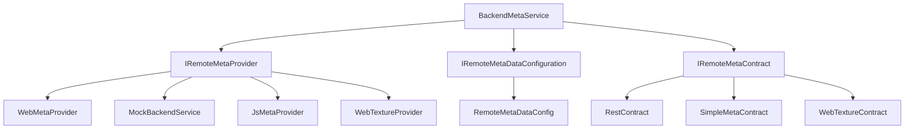

# UniGame Meta Service

Comprehensive contract-based backend transport system for Unity, supporting REST API, JavaScript Bridge, Mock providers, and Web Texture loading with flexible provider architecture.

## Overview

UniGame Meta Service is a flexible, contract-based backend communication system that provides:

- **Multiple Provider Support**: REST API, Mock, JavaScript Bridge, Web Texture loading
- **Contract-Based Architecture**: Type-safe request/response handling
- **Automatic Code Generation**: Generate contracts from Swagger/OpenAPI specifications
- **Provider Switching**: Runtime provider switching for different environments
- **Comprehensive Error Handling**: Built-in error types and fallback mechanisms

# Installation

## Dependencies

Add to your `manifest.json`:

```json
{
  "dependencies": {
     "com.unity.addressables": "2.6.0",
     "com.unigame.metaservice": "https://github.com/UnioGame/unity.meta.backend.git",
     "com.unigame.addressablestools": "https://github.com/UnioGame/unigame.addressables.git",
     "com.unigame.contextdata" : "https://github.com/UnioGame/unigame.context.git",
     "com.unigame.unicore": "https://github.com/UnioGame/unigame.core.git",
     "com.unigame.localization": "https://github.com/UnioGame/unigame.localization.git",
     "com.unigame.rx": "https://github.com/UnioGame/unigame.rx.git",
     "com.cysharp.unitask" : "https://github.com/Cysharp/UniTask.git?path=src/UniTask/Assets/Plugins/UniTask",
     "com.cysharp.r3": "https://github.com/Cysharp/R3.git?path=src/R3.Unity/Assets/R3.Unity"
  }
}
```

## System Components




# Basic Setup

## BackendMetaSource

You can use **BackendMetaSource** to create a backend service instance:

```csharp
    /// <summary>
    /// Represents a class that provides backend meta data for the game.
    /// </summary>
    [CreateAssetMenu(menuName = "UniGame/MetaBackend/Backend Meta Source", fileName = "Backend Meta Source")]
    public class BackendMetaSource : DataSourceAsset<IBackendMetaService>
```

Or you can create a backend service manually

## RemoteMetaDataConfigAsset

```csharp
    [CreateAssetMenu(menuName = "UniGame/MetaBackend/Remote Meta Data Config")]
    public class RemoteMetaDataConfigAsset : ScriptableObject
```

the main configuration asset for backend meta data, allowing you to define providers, contracts, and settings of your remote.

## IBackendMetaService

IBackendMetaService - main interface for backend service management, providing methods to connect, switch providers, and execute contracts.

```csharp
    public interface IBackendMetaService : 
        IMetaConnection,
        ILifeTimeContext
```

# Contracts

Contracts are the core of the backend communication system, defining how requests and responses are structured.

## Base contract interface

```csharp
public interface IRemoteMetaContract
{
    object Payload { get; }      // Request data
    string Path { get; }         // API endpoint path
    Type OutputType { get; }     // Response type
    Type InputType { get; }      // Request type
}
```

Generic base contract with typed input/output:

```csharp
public abstract class RemoteMetaContract<TInput, TOutput> : IRemoteMetaContract
{
    public virtual Type InputType => typeof(TInput);
    public virtual Type OutputType => typeof(TOutput);
    public abstract object Payload { get; }
    public abstract string Path { get; }
}
```

## Simple Contracts

Pre-built implementations for common scenarios:

```csharp
// Full request/response contract
public class SimpleMetaContract<TInput, TOutput> : RemoteMetaContract<TInput, TOutput>
{
    [SerializeField] public TInput inputData;
    [SerializeField] public string path;
    
    public override object Payload => inputData;
    public override string Path => path;
}

// Input-only contract
public class SimpleInputContract<TInput> : SimpleMetaContract<TInput, string>
{
    // Inherits from SimpleMetaContract<TInput, string>
}

// Output-only contract  
public class SimpleOutputContract<TOutput> : SimpleMetaContract<string, TOutput>
{
    // Inherits from SimpleMetaContract<string, TOutput>
}
```

Each contract provider can support custom contracts, allowing you to define specific request/response structures.

## Contract Execution

```csharp
// Direct service execution
var result = await backendService.ExecuteAsync(contract);

// Extension method execution (recommended)
var typedResult = await contract.ExecuteAsync<UserProfile>();
```

## Web Request Contracts

For REST API integration:

```csharp
public interface IWebRequestContract : IRemoteMetaContract, IFallbackContract
{
    WebRequestType RequestType { get; }  // GET, POST, PUT, DELETE, PATCH
    string Url { get; set; }            // Full URL override
    string Token { get; set; }          // Authentication token
}
```

### Creating Custom Contracts

```csharp
[Serializable]
public class UserProfileContract : RestContract<UserProfileRequest, UserProfileResponse>
{
    public override string Path => "api/user/profile";
    public override WebRequestType RequestType => WebRequestType.Get;
}

[Serializable]
public class UserProfileRequest
{
    public string userId;
    public bool includePreferences;
}

[Serializable]
public class UserProfileResponse
{
    public string id;
    public string name;
    public string email;
    public UserPreferences preferences;
}
```

# Providers

## Web Provider (REST API)

Primary provider for HTTP/HTTPS REST API communication.

### Configuration

```csharp
[CreateAssetMenu(menuName = "Game/Web Provider")]
public class GameWebProvider : WebMetaProviderAsset
{
    // Configured via inspector
}
```

### Settings

```csharp
[Serializable]
public class WebMetaProviderSettings
{
    public string defaultUrl = "https://api.example.com";
    public string defaultToken = "";
    public int requestTimeout = 30;
    public bool debugMode = false;
    public bool useStreamingSettings = false;
    public List<WebApiEndPoint> contracts = new();
}
```

### Usage

```csharp
// Set authentication token
var webProvider = backendService.GetProvider(BackendTypeIds.WebProvider) as IWebMetaProvider;
webProvider.SetToken("bearer-token");

// Execute web request
var contract = new GetUserDataContract { userId = "123" };
var result = await contract.ExecuteAsync<UserData>();
```

## Mock Provider

For testing and development without real backend.

### Configuration

```csharp
[Serializable]
public class MockBackendDataConfig
{
    public bool allowConnect = true;
    public List<MockBackendData> mockBackendData = new();
}

[Serializable]
public class MockBackendData
{
    public string Method;     // Contract method name
    public bool Success;      // Mock success/failure
    public string Result;     // Mock response data (JSON)
    public string Error;      // Mock error message
}
```

### Usage

```csharp
// Mock data configuration
var mockData = new MockBackendData
{
    Method = "GetUserProfile",
    Success = true,
    Result = JsonConvert.SerializeObject(new UserProfile { name = "Test User" }),
    Error = ""
};

// Provider will return mock data instead of real API calls
```

## JavaScript Bridge Provider

For WebGL builds to communicate with browser JavaScript.

### Configuration

```csharp
[Serializable]
public class JsMetaContractConfig
{
    public List<JsMetaContractData> contracts = new();
}

[Serializable]
public class JsMetaContractData
{
    public int id;
    public string Name;
    public SType contract;
}
```

### JavaScript Bridge Setup

```javascript
// Browser-side JavaScript
window.JsBridge_Agent = {
    SendMessage: function(contractId, message) {
        // Handle message from Unity
        console.log('Received from Unity:', contractId, message);
        
        // Send response back to Unity
        gameInstance.SendMessage('JsBridge_Agent', 'InvokeReceiveMessage', responseData);
    }
};
```

### Unity Usage

```csharp
// Contract for JS bridge communication
public class JsApiContract : IRemoteMetaContract
{
    public string apiMethod;
    public object requestData;
    
    public object Payload => requestData;
    public string Path => apiMethod;
    public Type OutputType => typeof(string);
    public Type InputType => typeof(object);
}
```

## Web Texture Provider

For loading textures and sprites from web URLs.

### Configuration

```csharp
[Serializable]
public class WebTextureSettings
{
    public string url = "";
    public bool useCache = true;
    public List<WebTexturePath> textures = new();
}

[Serializable]
public class WebTexturePath
{
    public string name;
    public string url;
}
```

### Usage

```csharp
// Load texture from web
var textureContract = new WebTexture2DContract 
{ 
    name = "profile-avatar",
    lifeTime = this.GetAssetLifeTime()
};

var result = await textureContract.ExecuteAsync<Texture2D>();
if (result.success)
{
    myRenderer.material.mainTexture = result.data;
}

// Load sprite from web
var spriteContract = new WebSpriteContract 
{ 
    name = "ui-icon",
    lifeTime = this.GetAssetLifeTime()
};

var spriteResult = await spriteContract.ExecuteAsync<Sprite>();
if (spriteResult.success)
{
    myImage.sprite = spriteResult.data;
}
```


## Nakama Server Provider

Base Nakama service provider API:

```csharp

    public interface INakamaService : IRemoteMetaProvider, IGameService
    {
        UniTask<NakamaConnectionResult> SignInAsync(INakamaAuthenticateData authenticateData);
    }

```


# REST API Contract Generation

## Swagger/OpenAPI Support

Automatically generate C# contracts from Swagger 2.0 and OpenAPI 3.0 specifications.

## Generator Settings

```csharp
[Serializable]
public class WebApiSettings
{
    [FilePath] public string apiJsonPath;           // Path to Swagger/OpenAPI JSON
    public string contractsOutFolder;               // Output folder for contracts
    public string dtoOutFolder;                     // Output folder for DTOs
    public string contractNamespace;                // Generated code namespace
    public string apiTemplate = "api/{0}";          // URL template
    public string[] apiAllowedPaths;               // Filter specific paths
    public bool cleanUpOnGenerate = false;         // Clean output folders
    public bool useResponseDataContainer = false;  // Handle response wrappers
    public string responseDataField = "data";      // Response wrapper field name
}
```

## Code Generation

Access via **Tools/WebApi/Regenerate API Contracts**

```csharp
var settings = new WebApiSettings
{
    apiJsonPath = "path/to/openapi.json",
    contractsOutFolder = "Assets/Generated/Contracts/",
    dtoOutFolder = "Assets/Generated/DTOs/",
    contractNamespace = "Game.Generated.WebContracts",
    apiTemplate = "api/{0}",
    cleanUpOnGenerate = true
};

WebApiGenerator.GenerateContracts(settings);

```

## Configuration Options

For APIs that wrap responses in containers:

```json
{
  "data": {
    "id": 5,
    "name": "John",
    "email": "john@example.com"
  },
  "success": true,
  "message": "OK"
}
```

Enable container support:

```csharp
settings.useResponseDataContainer = true;
settings.responseDataField = "data";
```

Generated contract:

```csharp
public class GetUserContract : RestContract<GetUserRequest, ResponseDataDTO<UserDTO>>
{
    public override string Path => "api/user";
    public override WebRequestType RequestType => WebRequestType.Get;
}
```

## Dynamic URL Parameters

Support for dynamic URL path parameters:

```csharp
// URL template: "api/store/{id}/{category}/items"
[Serializable]
public class StoreItemsContract : RestContract<StoreRequest, StoreResponse>
{
    public string id = "123";        // Replaces {id}
    public string category = "books"; // Replaces {category}
    
    public override string Path => "api/store/{id}/{category}/items";
}

// Results in: "api/store/123/books/items"
```

## Response Data Containers

Handle APIs with response wrappers:

```csharp
// API returns: { "data": { "user": {...} }, "success": true }
public class ResponseDataDTO<T>
{
    [JsonProperty("data")]
    public T Data { get; set; }
    
    [JsonProperty("success")]
    public bool Success { get; set; }
    
    [JsonProperty("message")]
    public string Message { get; set; }
}
```

## Error Handling

```csharp
public class UserContract : RestContract<UserRequest, UserResponse, ErrorResponse>
{
    // Contract with explicit error type
}

// Usage with error handling
var result = await contract.ExecuteAsync<UserResponse, ErrorResponse>();
if (!result.success)
{
    var error = result.errorData; // Typed error data
    Debug.LogError($"API Error: {error.message}");
}
```

## Global Error Handling

```csharp
// Subscribe to all backend errors
backendService.DataStream
    .Where(result => !result.success)
    .Subscribe(result => 
    {
        Debug.LogError($"Backend Error: {result.error}");
        // Handle global error logic
    })
    .AddTo(lifeTime);
```

# Streaming Assets Integration

Load configuration from StreamingAssets at runtime:

```csharp
// Enable streaming assets in WebMetaProviderSettings
settings.useStreamingSettings = true;
settings.useStreamingUnderEditor = false; // Only in builds

// Save settings to StreamingAssets
webProviderAsset.SaveSettingsToStreamingAsset();

// Settings will be loaded from StreamingAssets/web_meta_provider_settings.json
```

## License

This module is licensed under the MIT license.
