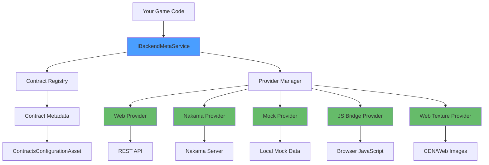

# UniGame Meta Backend Service

Universal contract-based backend communication system for Unity supporting REST APIs, WebGL JavaScript Bridge, Nakama, Mock providers, and runtime texture loading.

## Key Features

- 🔌 **Multi-Provider Architecture** - REST API, Nakama, JavaScript Bridge, Mock, Web Texture
- 📝 **Type-Safe Contracts** - Strongly typed request/response handling
- 🔄 **Auto Code Generation** - Generate C# contracts from Swagger/OpenAPI specs
- 🔀 **Runtime Provider Switching** - Switch backends dynamically (production/staging/mock)
- 🛠️ **Editor Tools** - Real-time contract monitoring and OpenAPI generator UI
- 🎯 **UniTask Integration** - Modern async/await patterns with cancellation support


## Installation

### Add to `manifest.json`:

```json
{
  "dependencies": {
    "com.unity.addressables": "2.6.0",
    "com.unigame.metaservice": "https://github.com/UnioGame/unity.meta.backend.git",
    "com.unigame.addressablestools": "https://github.com/UnioGame/unigame.addressables.git",
    "com.unigame.contextdata": "https://github.com/UnioGame/unigame.context.git",
    "com.unigame.unicore": "https://github.com/UnioGame/unigame.core.git",
    "com.unigame.localization": "https://github.com/UnioGame/unigame.localization.git",
    "com.unigame.rx": "https://github.com/UnioGame/unigame.rx.git",
    "com.cysharp.unitask": "https://github.com/Cysharp/UniTask.git?path=src/UniTask/Assets/Plugins/UniTask",
    "com.cysharp.r3": "https://github.com/Cysharp/R3.git?path=src/R3.Unity/Assets/R3.Unity"
  }
}
```

## Architecture



## Quick Start

### 1. Create Configuration

**Menu:** `Assets/UniGame/Meta Service/Create Configuration`

This creates a `ContractsConfigurationAsset` that manages all backend contracts and providers.

### 2. Define a Contract

```csharp
using Game.Modules.WebProvider.Contracts;
using UniGame.MetaBackend.Runtime.WebService;

[Serializable]
public class GetUserProfileContract : RestContract<UserProfileRequest, UserProfileResponse>
{
    public override string Path => "api/user/profile";
    public override WebRequestType RequestType => WebRequestType.Get;
}

[Serializable]
public class UserProfileRequest
{
    public string userId;
}

[Serializable]
public class UserProfileResponse
{
    public string name;
    public string email;
    public int level;
}
```

### 3. Execute Contract

```csharp
using Extensions;

public async UniTask LoadUserProfile()
{
    var contract = new GetUserProfileContract 
    { 
        input = new UserProfileRequest { userId = "12345" }
    };
    
    var result = await contract.ExecuteAsync<UserProfileResponse>();
    
    if (result.success)
    {
        Debug.Log($"Welcome, {result.data.name}!");
    }
    else
    {
        Debug.LogError($"Failed: {result.error}");
    }
}
```

## Core Concepts

### Contracts

Contracts define the communication interface between your game and backend services.

#### Base Interface

```csharp
public interface IRemoteMetaContract
{
    object Payload { get; }      // Request data
    string Path { get; }         // Endpoint path
    Type OutputType { get; }     // Response type
    Type InputType { get; }      // Request type
}
```

#### Generic Base

```csharp
public abstract class RemoteMetaContract<TInput, TOutput> : IRemoteMetaContract
{
    public virtual Type InputType => typeof(TInput);
    public virtual Type OutputType => typeof(TOutput);
    public abstract object Payload { get; }
    public abstract string Path { get; }
}
```

#### Pre-Built Simple Contracts

```csharp
// Full request/response
public class SimpleMetaContract<TInput, TOutput> : RemoteMetaContract<TInput, TOutput>
{
    [SerializeField] public TInput inputData;
    [SerializeField] public string path;
}

// Input only (response is string)
public class SimpleInputContract<TInput> : SimpleMetaContract<TInput, string>

// Output only (request is string)
public class SimpleOutputContract<TOutput> : SimpleMetaContract<string, TOutput>
```

### Providers

Providers handle the actual communication with different backend systems.

#### IBackendMetaService

Main service interface managing all providers:

```csharp
public interface IBackendMetaService : ILifeTimeContext
{
    // Execute contract
    UniTask<ContractDataResult> ExecuteAsync(IRemoteMetaContract contract, CancellationToken cancellationToken = default);
    
    // Switch active provider
    void SwitchProvider(int providerId);
    
    // Get specific provider
    IRemoteMetaProvider GetProvider(int id);
    
    // Observable stream of all results
    Observable<ContractDataResult> DataStream { get; }
    
    // Current configuration
    IRemoteMetaDataConfiguration MetaDataConfiguration { get; }
}
```

#### Creating Service

```csharp
// Using BackendMetaSource asset
[CreateAssetMenu(menuName = "UniGame/MetaBackend/Backend Meta Source")]
public class BackendMetaSource : DataSourceAsset<IBackendMetaService>
{
    // Configure in inspector
}

// Or manually
var service = new BackendMetaService(
    useDefaultProvider: true,
    historySize: 100,
    defaultMetaProvider: BackendTypeIds.WebProvider,
    metaProviders: providerDictionary,
    metaDataConfiguration: configuration
);
```

#### Provider Switching

Switch between different providers at runtime:

```csharp
// Switch to production
backendService.SwitchProvider(BackendTypeIds.ProductionProvider);

// Switch to mock for testing
backendService.SwitchProvider(BackendTypeIds.MockProvider);

// Get specific provider
var webProvider = backendService.GetProvider(BackendTypeIds.WebProvider);
```

## Providers

### Web Provider (REST API)

HTTP/HTTPS REST API communication.

#### Contract Definition

```csharp
[Serializable]
public class LoginContract : RestContract<LoginRequest, LoginResponse>
{
    public override string Path => "auth/login";
    public override WebRequestType RequestType => WebRequestType.Post;
}
```

#### Web Request Types

```csharp
public enum WebRequestType
{
    None,
    Get,
    Post,
    Put,
    Delete,
    Patch
}
```

#### Configuration

```csharp
public class WebMetaProviderSettings
{
    public string defaultUrl = "https://api.example.com";
    public string defaultToken = "";
    public int requestTimeout = 30;
    public bool debugMode = false;
    public List<WebApiEndPoint> contracts = new();
}
```

#### Authentication

```csharp
var webProvider = backendService.GetProvider(BackendTypeIds.WebProvider) as IWebMetaProvider;
webProvider.SetToken("your-bearer-token");
```

#### Error Handling

```csharp
// Contract with typed error
public class UserContract : RestContract<UserRequest, UserResponse, ErrorResponse>
{
    // Implementation
}

// Execute with error handling
var result = await contract.ExecuteAsync<UserResponse, ErrorResponse>();
if (!result.success)
{
    var error = result.errorData; // Typed ErrorResponse
    Debug.LogError($"Error: {error.message}");
}
```

#### StreamingAssets Integration

Load Web Provider configuration from StreamingAssets in builds:

```csharp
// In WebMetaProviderSettings
settings.useStreamingSettings = true;
settings.useStreamingUnderEditor = false; // Only in builds

// Save to StreamingAssets
webProviderAsset.SaveSettingsToStreamingAsset();

// Settings loaded from: StreamingAssets/web_meta_provider_settings.json
```

### Nakama Provider

Integration with Nakama server.

```csharp
public interface INakamaService : IRemoteMetaProvider, IGameService
{
    UniTask<NakamaConnectionResult> SignInAsync(
        INakamaAuthenticateData authenticateData,
        CancellationToken cancellationToken = default);
    
    UniTask<bool> SignOutAsync();
}
```

### Mock Provider

For testing without real backend.

#### Configuration

```csharp
[Serializable]
public class MockBackendData
{
    public string Method;     // Contract method name
    public bool Success;      // Mock success/failure
    public string Result;     // Mock response (JSON)
    public string Error;      // Mock error message
}

[Serializable]
public class MockBackendDataConfig
{
    public bool allowConnect = true;
    public List<MockBackendData> mockBackendData = new();
}
```

#### Example

```csharp
var mockData = new MockBackendData
{
    Method = "GetUserProfile",
    Success = true,
    Result = JsonConvert.SerializeObject(new UserProfile 
    { 
        name = "Test User",
        level = 10 
    }),
    Error = ""
};
```

### JavaScript Bridge Provider

For WebGL builds to communicate with browser JavaScript.

#### Unity Side

```csharp
public class JsApiContract : IRemoteMetaContract
{
    public string apiMethod;
    public object requestData;
    
    public object Payload => requestData;
    public string Path => apiMethod;
}
```

#### Browser Side

```javascript
window.JsBridge_Agent = {
    SendMessage: function(contractId, message) {
        console.log('From Unity:', contractId, message);
        
        // Process and respond
        var response = { result: "success" };
        gameInstance.SendMessage('JsBridge_Agent', 'InvokeReceiveMessage', 
            JSON.stringify(response));
    }
};
```

### Web Texture Provider

Load textures and sprites from URLs at runtime.

#### Load Texture2D

```csharp
var textureContract = new WebTexture2DContract 
{ 
    name = "profile-avatar",
    lifeTime = this.GetAssetLifeTime()
};

var result = await textureContract.ExecuteAsync<Texture2D>();
if (result.success)
{
    myRenderer.material.mainTexture = result.data;
}
```

#### Load Sprite

```csharp
var spriteContract = new WebSpriteContract 
{ 
    name = "ui-icon",
    lifeTime = this.GetAssetLifeTime()
};

var result = await spriteContract.ExecuteAsync<Sprite>();
if (result.success)
{
    myImage.sprite = result.data;
}
```

#### Configuration

```csharp
[Serializable]
public class WebTextureSettings
{
    public string url = "";
    public bool useCache = true;
    public List<WebTexturePath> textures = new();
}

[Serializable]
public class WebTexturePath
{
    public string name;
    public string url;
}
```

## OpenAPI/Swagger Code Generation

Automatically generate C# contracts and DTOs from OpenAPI 3.0 or Swagger 2.0 specifications with full support for composition schemas (allOf/anyOf/oneOf), multiple content types, and servers.

### OpenAPI Generator Editor


**Menu:** `UniGame > Meta Backend > OpenApi Generator`

The visual editor provides:
- Settings asset management
- API specification configuration (supports both Swagger 2.0 and OpenAPI 3.0)
- Output folder configuration
- Generation options
- One-click generation

### Features

#### ✅ Full OpenAPI 3.0 Support
- **Servers Array** - Automatic base URL extraction from servers configuration
- **Multiple Content Types** - Handles application/json, application/xml, multipart/form-data
- **requestBody** - Full support for OpenAPI 3.0 request bodies
- **components/schemas** - Modern schema references

#### ✅ Schema Composition
- **allOf** - Schema inheritance and merging
- **anyOf** - Union types
- **oneOf** - Discriminated unions with discriminator support
- **Polymorphism** - Type discrimination for complex hierarchies

#### ✅ Advanced Type Support
- **Extended Formats** - email, uri, hostname, ipv4, ipv6, uuid, date-time
- **Enum Generation** - C# enums from OpenAPI enum values
- **Deprecated Attributes** - [Obsolete] for deprecated properties and operations
- **Nullable Types** - Proper handling of nullable properties

#### ✅ Backward Compatible
- **Swagger 2.0** - Full support for definitions, basePath, consumes/produces
- **Automatic Detection** - Seamlessly works with both specifications

### Settings

```csharp
[Serializable]
public class OpenApiSettings
{
    public string apiJsonPath;              // Path to OpenAPI JSON
    public string contractsOutFolder;       // Contracts output folder
    public string dtoOutFolder;             // DTOs output folder
    public string contractNamespace;        // Generated code namespace
    public string apiTemplate = "api/{0}";  // URL template
    public string[] apiAllowedPaths;        // Filter endpoints
    public bool cleanUpOnGenerate = false;  // Clean before generate
    public bool useResponseDataContainer;   // Handle wrapped responses
    public string responseDataField = "data";
}
```

### Programmatic Generation

```csharp
var settings = new OpenApiSettings
{
    apiJsonPath = "path/to/openapi.json",
    contractsOutFolder = "Assets/Generated/Contracts/",
    dtoOutFolder = "Assets/Generated/DTOs/",
    contractNamespace = "Game.Generated.WebContracts",
    apiTemplate = "api/{0}",
    cleanUpOnGenerate = true
};

WebApiGenerator.GenerateContracts(settings);
```

### Generated Output

#### Contract Example

```csharp
// Generated from OpenAPI spec
namespace Game.Generated.WebContracts
{
    [Serializable]
    public class GetUserByIdContract : RestContract<GetUserByIdRequest, UserDTO>
    {
        public override string Path => "api/users/{id}";
        public override WebRequestType RequestType => WebRequestType.Get;
    }
}
```

#### DTO Example

```csharp
namespace Game.Generated.WebContracts.DTO
{
    [Serializable]
    public class UserDTO
    {
        [JsonProperty("id")]
        [field: SerializeField]
        public int Id { get; set; }
        
        [JsonProperty("name")]
        [field: SerializeField]
        public string Name { get; set; }
        
        [JsonProperty("email")]
        [field: SerializeField]
        public string Email { get; set; }
    }
}
```

### Dynamic URL Parameters

```csharp
[Serializable]
public class GetStoreItemsContract : RestContract<StoreRequest, StoreResponse>
{
    public string categoryId = "weapons";
    public string itemId = "sword_01";
    
    public override string Path => "api/store/{categoryId}/items/{itemId}";
    // Resolves to: "api/store/weapons/items/sword_01"
}
```

### Response Data Containers

For APIs that wrap responses:

```json
{
  "data": {
    "userId": 123,
    "name": "Player"
  },
  "success": true
}
```

Enable in settings:

```csharp
settings.useResponseDataContainer = true;
settings.responseDataField = "data";
```

Generated contract:

```csharp
public class GetUserContract : RestContract<GetUserRequest, ResponseDataDTO<UserDTO>>
{
    // Container automatically unwrapped
}
```

## Advanced Features

### Global Error Handling

Subscribe to all backend errors:

```csharp
backendService.DataStream
    .Where(result => !result.success)
    .Subscribe(result => 
    {
        Debug.LogError($"Backend Error: {result.error}");
        ShowErrorPopup(result.error);
    })
    .AddTo(lifeTime);
```

### Contract Handlers

Add custom processing for contracts:

```csharp
public interface IMetaContractHandler
{
    UniTask<bool> HandleAsync(MetaContractData data, CancellationToken cancellationToken);
}

// Add handler
backendService.AddContractHandler(myCustomHandler);

// Remove handler
backendService.RemoveContractHandler<MyCustomHandler>();
```

## Editor Tools

### Contract Monitor Window

**Menu:** `UniGame > Meta Backend > Meta Editor Window`

Real-time monitoring and debugging of contract execution:

- **Configuration Panel** - View all registered contracts and settings
- **Execution History** - Full history with search and filtering
- **Real-time Stream** - Live updates as contracts execute
- **Export Functionality** - Export history to JSON

Features:
- Auto-refresh every 500ms
- Success/failure indicators
- Search by meta ID, type, or error
- Copy contract results
- Connection status indicator

### OpenAPI Generator Window

**Menu:** `UniGame > Meta Backend > OpenApi Generator`

Visual interface for generating contracts:

- Settings asset management
- API specification browser
- Output configuration
- Generation options
- One-click contract generation

### Integration

Both windows work together seamlessly:
- Generate contracts with OpenAPI Generator
- Monitor execution in Contract Monitor
- Update contract list in `ContractsConfigurationAsset`

## Best Practices

### 1. Contract Organization

```csharp
// Group contracts by feature
namespace Game.Contracts.User
{
    public class LoginContract : RestContract<...> { }
    public class GetProfileContract : RestContract<...> { }
}

namespace Game.Contracts.Store
{
    public class GetItemsContract : RestContract<...> { }
    public class PurchaseContract : RestContract<...> { }
}
```

### 2. Error Handling

```csharp
// Always handle errors
var result = await contract.ExecuteAsync<ResponseType>();
if (!result.success)
{
    // Log error
    Debug.LogError($"Contract failed: {result.error}");
    
    // Show user-friendly message
    ShowErrorMessage("Connection failed. Please try again.");
    
    return;
}

// Process successful result
ProcessData(result.data);
```

### 3. Cancellation Support

```csharp
private CancellationTokenSource _cts;

public async UniTask LoadData()
{
    _cts = new CancellationTokenSource();
    
    try
    {
        var result = await contract.ExecuteAsync<DataType>(_cts.Token);
        ProcessResult(result);
    }
    catch (OperationCanceledException)
    {
        Debug.Log("Operation cancelled");
    }
}

public void CancelOperation()
{
    _cts?.Cancel();
}
```

### 4. Provider Configuration

```csharp
// Use different providers per environment
#if DEVELOPMENT
    var providerId = BackendTypeIds.MockProvider;
#elif STAGING
    var providerId = BackendTypeIds.StagingProvider;
#else
    var providerId = BackendTypeIds.ProductionProvider;
#endif

backendService.SwitchProvider(providerId);
```

### 5. Testing with Mocks

```csharp
// Set up mock data for testing
var mockConfig = new MockBackendDataConfig
{
    allowConnect = true,
    mockBackendData = new List<MockBackendData>
    {
        new MockBackendData
        {
            Method = "GetUserProfile",
            Success = true,
            Result = JsonConvert.SerializeObject(testProfile)
        },
        new MockBackendData
        {
            Method = "PurchaseItem",
            Success = false,
            Error = "Insufficient funds"
        }
    }
};
```

## Troubleshooting

### Contract Not Executing

1. Verify `BackendMetaService` is initialized
2. Check that contract is registered in `ContractsConfigurationAsset`
3. Ensure the correct provider supports the contract type
4. Review logs in Contract Monitor window

### Provider Connection Failed

1. Verify URL/endpoint configuration
2. Check authentication token if required
3. Test with Mock provider to isolate network issues
4. Review provider-specific settings

### Generated Contracts Have Errors

1. Validate OpenAPI specification (use Swagger Editor)
2. Check namespace configuration
3. Verify output folders are writable
4. Review OpenAPI Generator settings

### No Data in Contract Monitor

1. Ensure Play Mode is active
2. Verify `BackendMetaService.EditorInstance` is assigned
3. Check that contracts are actually executing
4. Enable Auto Refresh in monitor window

## Examples

### Complete Example: User Authentication

```csharp
using System;
using Cysharp.Threading.Tasks;
using Extensions;
using Game.Modules.WebProvider.Contracts;
using UniGame.MetaBackend.Runtime.WebService;
using UnityEngine;

namespace Game.Features.Auth
{
    // Contract definition
    [Serializable]
    public class LoginContract : RestContract<LoginRequest, LoginResponse>
    {
        public override string Path => "auth/login";
        public override WebRequestType RequestType => WebRequestType.Post;
    }

    [Serializable]
    public class LoginRequest
    {
        public string username;
        public string password;
    }

    [Serializable]
    public class LoginResponse
    {
        public string token;
        public string userId;
        public string displayName;
    }

    // Service implementation
    public class AuthService : MonoBehaviour
    {
        public async UniTask<bool> LoginAsync(string username, string password)
        {
            var contract = new LoginContract
            {
                input = new LoginRequest
                {
                    username = username,
                    password = password
                }
            };

            var result = await contract.ExecuteAsync<LoginResponse>();

            if (result.success)
            {
                // Store token
                PlayerPrefs.SetString("auth_token", result.data.token);
                
                // Set token for future requests
                var webProvider = BackendMetaServiceExtensions.RemoteMetaService
                    .GetProvider(BackendTypeIds.WebProvider) as IWebMetaProvider;
                webProvider?.SetToken(result.data.token);
                
                Debug.Log($"Logged in as {result.data.displayName}");
                return true;
            }
            else
            {
                Debug.LogError($"Login failed: {result.error}");
                return false;
            }
        }
    }
}
```

## License

MIT License

---

**Documentation Version:** 2025.0.20  
**Package Version:** 2025.0.20  
**Unity Version:** 2023.1+
